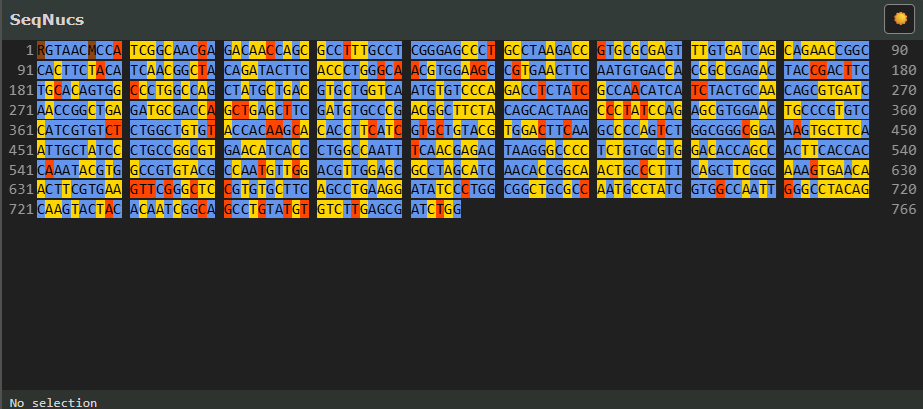

# SeqNucs — DNA Sequence Text Viewer

Example of using the SeqNucs canvas library to display a processed DNA
nucleotide sequence from a Sanger-style sequencing instrument.

**[Live demo](https://pkvspb.github.io/seqnucs-public/examples/vanilla/index.html)**

- **Per-base quality background** — each nucleotide letter is drawn on a
  color-coded background keyed by quality tier (low < 10, medium < 30, high ≥ 30)
  and a separate color for IUPAC ambiguity codes; all colors are fully
  customisable via the `colors` argument
- **Groups of 10** — bases are displayed in groups of 10 with a gap between
  groups; row-start and row-end position numbers appear in the margins
- **Mouse drag selection** — click and drag to select a range; selected bases
  highlight with a white background
- **Ctrl+C copy** — copies the selected nucleotide letters to the clipboard
  (no spaces, no position numbers)
- **Theme-agnostic** — the library draws with whatever single `colors` palette
  it's given; light/dark detection and switching are the caller's job
- **Auto-resize** — the viewer fills its container and redraws automatically
  when the container size changes (ResizeObserver)



## Demos

Two equivalent demos are included — a build-free vanilla JS/HTML/CSS version
and a Vite + React version.

### Vanilla demo (no build step)

ES modules require a local server (browsers block `file://` imports).

```bash
npx http-server -p 8080 -c-1
```

Then open `http://localhost:8080/examples/vanilla/` in a browser.

VS Code: start the server, then **F5** → **Vanilla demo**.

### React demo

```bash
cd examples/react
npm install
npm run dev
```

Then open the URL Vite prints (defaults to `http://localhost:5173/`), or with
the dev server running, VS Code: **F5** → **React demo**. See
[React wrapper pattern](#react-wrapper-pattern) below for how the library is
integrated as a component.

## Files

| File | Purpose |
|------|---------|
| `examples/vanilla/index.html` | Page structure — the single required container element |
| `examples/vanilla/example.css` | Layout and theming — adjust the `--*` constants at the top |
| `examples/vanilla/example.js` | Theme detection, data loading and `initSeqNucs` call |
| `examples/react/` | React demo — see [React wrapper pattern](#react-wrapper-pattern) below |
| `api/mockSeqProcessedValues.js` | Mock processed data: nucleotide calls and quality scores |
| `lib/seqnucs.js` | Library file — **import this file** |

## DOM contract

`initSeqNucs` requires a single `<div>` with `position: relative` as its
container. Pass the element's `id` as the first argument — the library creates
two `<canvas>` elements inside it (main render + selection overlay) and manages
their lifetime.

```html
<div id="seqnucs-container-id" style="position: relative;"></div>
```

**Size the container with CSS.** The library reads its dimensions via
`ResizeObserver` and redraws whenever the size changes. Set `overflow-y: auto`
if you want the container to scroll when there are many rows.

## Providing your own data

```js
const peaks = [
    { nuc: 'A', number: 1, quality: 42 },
    { nuc: 'C', number: 2, quality: 28 },
    { nuc: 'G', number: 3, quality:  7 },
    // ...one entry per called base
];
```

| Field | Type | Description |
|-------|------|-------------|
| `nuc` | `string` | Base call — A/C/G/T or an IUPAC ambiguity code |
| `number` | `number` | 1-based position displayed in the row margins |
| `quality` | `number` | Phred-like quality score (drives background color) |

## `initSeqNucs` reference

```js
const { redraw, unInit } = initSeqNucs(
    containerId,
    peaks,
    colors,
    onSelectionChanged,
);
```

| Parameter | Type | Description |
|-----------|------|-------------|
| `containerId` | `string` | `id` of the container `<div>` |
| `peaks` | `Array<{nuc, number, quality}>` | Sequence data |
| `colors` | `object` | Color palette to draw with (see below) — the library has no theme concept of its own |
| `onSelectionChanged` | `(lo, hi) => void` | Called whenever the selection changes; `lo`/`hi` are view-indices |

| Return value | Description |
|--------------|-------------|
| `redraw()` | Force a full redraw with the same `colors` — e.g. after a manual layout change |
| `unInit()` | Remove all event listeners and the two canvas elements |

To switch theme, call `unInit()` and call `initSeqNucs(...)` again with a
different `colors` object — see [React wrapper pattern](#react-wrapper-pattern)
and `examples/vanilla/example.js` for the pattern.

### Color palette object

All values are CSS color strings (hex, `rgb()`, named colors, etc.). Build one
object per theme you support (e.g. `LIGHT_COLORS` / `DARK_COLORS`) and pass
whichever one is currently active.

| Field | What it colors |
|-------|---------------|
| `low` | Background of bases with quality < 10 |
| `med` | Background of bases with quality < 30 |
| `high` | Background of bases with quality ≥ 30 |
| `mutation` | Background of IUPAC ambiguity-code bases |
| `text` | Nucleotide letter color |
| `numText` | Row-margin position number color |
| `selection` | Background of selected bases |

```js
const LIGHT_COLORS = {
    low:       '#F8C9B9',
    med:       '#F9E7A8',
    high:      '#BFD7FF',
    mutation:  '#D9BEA3',
    text:      '#000',
    numText:   '#555',
    selection: '#fff',
};

const DARK_COLORS = {
    low:       '#543100',
    med:       '#484401',
    high:      '#012b49',
    mutation:  '#380101',
    text:      '#E0E0E0',
    numText:   '#999',
    selection: '#6b7988',
};
```

Set any field to any CSS color to match your application's palette.

## React wrapper pattern

`examples/react/` is a small Vite + React app showing how to wrap the library
as a component rather than calling `initSeqNucs` directly from a script.

Key file: `examples/react/src/SeqNucsComponent.jsx`. The pattern:

- A `useRef` on the container `<div>`, and a `useEffect` keyed on
  `[peaks, theme]` that picks `LIGHT_COLORS` or `DARK_COLORS` based on the
  `theme` prop, calls `initSeqNucs(...)` with that single palette, and returns
  `unInit` as the effect cleanup — React calls it automatically before the
  next effect run and on unmount.
- The `theme` dependency causes a clean re-init on every theme change, which
  is how the palette switch happens — the library itself never sees `theme`,
  it only ever draws with the one `colors` object it was given.
- The `onSelectionChanged` callback is passed as a prop and bubbled up to
  `App.jsx` to update the status bar.

This is the recommended approach when integrating SeqNucs into a
component-based app.

## Why Canvas instead of DOM

SeqNucs renders via HTML5 Canvas rather than individual DOM elements (one
`<span>` per nucleotide). A benchmark comparing both approaches with ~2 000
peaks showed:

| Instances on page | Canvas init | DOM init | Canvas drag | DOM drag |
|:-----------------:|:-----------:|:--------:|:-----------:|:--------:|
| 1 | **16.7 ms** | 25.4 ms | equal | equal |
| 4 | **16.7 ms** | 83.7 ms | **faster** | slower |

Key findings:

- **Canvas init time is constant** — the draw loop over 2 000 peaks takes the
  same ~17 ms regardless of how many instances are on the page.
- **DOM init scales linearly** — each additional instance adds ~20 ms because
  the browser must lay out thousands of new elements. At 4 instances the DOM
  approach is ~5× slower.
- **Drag/selection** — at 1 instance both approaches are equal; at 4+ the DOM
  approach slows noticeably due to reflow pressure.

Canvas also sidesteps the styling complexity of per-nucleotide quality
backgrounds and makes physical-pixel-snapping for crisp HiDPI rendering
straightforward.

## About the library file

The file in `lib/` is a pre-built, obfuscated distribution of the SeqNucs
library, vendored into this repository and updated periodically from upstream.
`api/mockSeqProcessedValues.js` provides the mock data used by both demos.
See [License](#license) for usage terms.

## License

This repository uses two licenses:

- **`lib/`** — the compiled, obfuscated `seqnucs.js` is proprietary and
  provided under the terms in [`lib/LICENSE`](lib/LICENSE): you may use it
  unmodified as a dependency in your own projects, but may not redistribute,
  modify, decompile, or resell it.
- **Everything else** (examples, mock data, documentation) is licensed under
  the Apache License, Version 2.0 — see [`LICENSE`](LICENSE).
